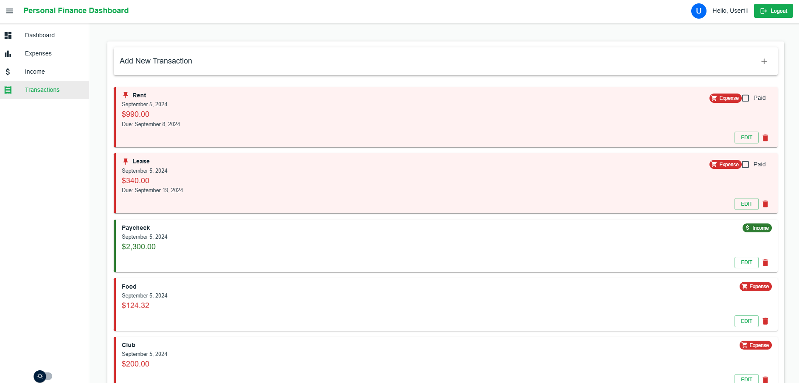
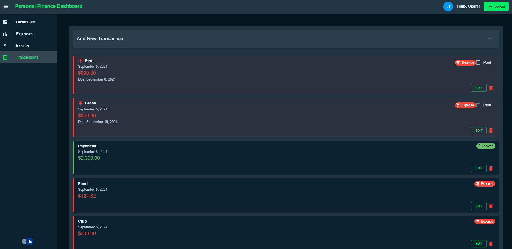

# Personal Finance Dashboard

An open-source, customizable full-stack web application for managing personal finances, built with React, Node.js, Express, and MongoDB.

## Project Overview

This Personal Finance Dashboard serves as a foundation for developers to quickly set up a secure, feature-rich financial management application. It's designed to be easily customizable and extendable, allowing you to learn from a well-structured application, quickly prototype your own financial tools, and modify functionality to suit your specific needs.

## Key Features

- User authentication (register, login, logout)
- Add, edit, and delete transactions with confirmation
- Categorize transactions as income or expense
- View recent transactions with due date highlighting
- Visualize expenses by category (pie chart)
- Compare income vs expenses (bar chart)
- Monthly budget overview with due payments calculation
- Responsive design for mobile and desktop
- **Light and Dark Mode**: Easily switch between light and dark themes for comfortable viewing in any environment
- **Transaction Management**:
  - Add new transactions with an intuitive, collapsible form
  - Edit existing transactions with a modal dialog
  - Delete transactions with a confirmation dialog to prevent accidental deletions
- **Due Payments**: Highlight and track expenses with due dates
- **Paid Status**: Mark expenses as paid and track payment status

## Project Structure

This project is divided into two main parts:

- `personal-finance-backend`: The backend API built with Node.js and Express
- `personal-finance-dashboard`: The frontend application built with React

## Getting Started

For detailed setup and running instructions, please refer to the README files in each subdirectory:

- [Backend README](./personal-finance-backend/README.md)
- [Frontend README](./personal-finance-dashboard/README.md)

## Technologies Used

- Frontend:
  - React
  - Material-UI
  - Chart.js
  - Framer Motion
  - date-fns
- Backend:
  - Node.js
  - Express
  - MongoDB with Mongoose
  - JSON Web Tokens (JWT) for authentication
  - bcrypt for password hashing

## Theme Customization

The application supports both light and dark modes, providing a comfortable viewing experience for users in different lighting conditions. Users can easily toggle between themes using the theme switch in the application interface.

 

## Customization

Feel free to modify any part of this application to suit your needs. Some ideas:

- Add new API endpoints for additional features
- Integrate with different databases or services
- Implement more advanced authentication methods
- Add data analysis or reporting features

## Contributing

Contributions are welcome! Please feel free to submit a Pull Request.

## License

This project is open-source and available under the MIT License. See the [LICENSE](./LICENSE) file for details.